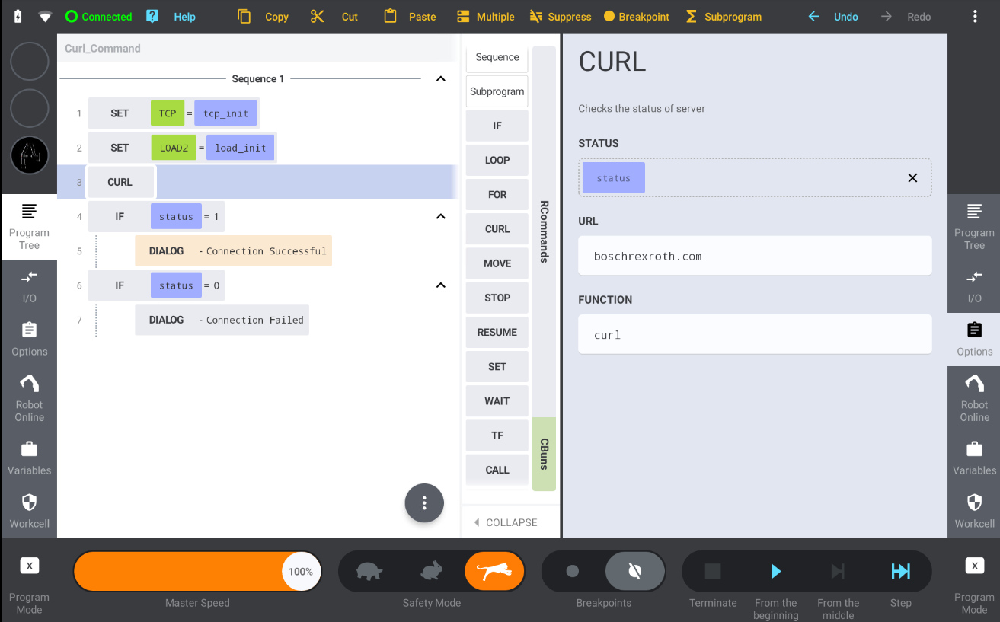

## Curl library implementation for Kassow Robots CBun

This repository provides a CBun Command class (`CurlCommand`) for performing HTTP requests using libcurl.

You can downlad the prebuilt CBun in Releases: 

https://github.com/kr-smu/curl-command/releases/download/0.1/curl_command.cbun

**Features:**

* Checks the Status of the server using Curl
* Proof of Concept implementation to demonstrate working Curl Library

**Usage:**

1. Build the CBun (Repopen in the Build Container > CMake Options > Configure > Release)
2. Load the CBun into the Robot using the USB and Install
3. Load the Curl_Command Program provided in the source
4. Click on the CURL command in programming screen
5. Enter any URL to check the Status

